# 🎬 AI Video Generator Pipeline

<div align="center">


**An automated AI-powered pipeline that transforms creative ideas into complete videos with images, music, and voice narration**

[🚀 Quick Start](#-quick-start) • [📖 Documentation](#-usage) • [🎯 Examples](#-output-structure) • [🤝 Contributing](#-contributing)

</div>

---

## ✨ What is AI Video Pipeline?

Transform your creative concepts into professional videos automatically! This pipeline combines cutting-edge AI models to generate unique content from scratch - no manual editing required.

> 💡 **Perfect for**: Content creators, marketers, educators, and anyone looking to automate video production with AI.

## 🎯 Key Features

<table>
<tr>
<td width="50%">

### 🧠 **AI-Powered Generation**
- 💭 **Smart Idea Creation** - GPT-4o generates unique concepts
- 🖼️ **High-Quality Images** - Flux Image Pro via Replicate
- 🎥 **Dynamic Videos** - Kling AI v1.6 for smooth motion
- 🎵 **Custom Music** - SonAuto ambient soundtracks
- 🗣️ **Natural Voice** - OpenAI TTS narration

</td>
<td width="50%">

### ⚡ **Production Ready**
- 🔄 **Batch Processing** - Generate multiple videos concurrently
- 🌐 **API & CLI** - Flexible integration options
- 📊 **Built-in Monitoring** - Prometheus metrics & health checks
- 🔒 **Security First** - Input validation & safe file operations
- 🐳 **Scalable** - Ready for production deployment

</td>
</tr>
</table>

---

## 🏗️ Architecture Overview

```mermaid
graph TD
    A[💭 Idea Generator] --> B[🖼️ Image Generator]
    A --> C[🎵 Music Generator]
    A --> D[🗣️ Voice Generator]
    B --> E[🎥 Video Generator]
    C --> F[🎬 Video Compositor]
    D --> F
    E --> F
    F --> G[📹 Final Video]
```



```
ai_video_pipeline/
├── 🎯 services/           # AI service integrations
│   ├── idea_generator.py    # GPT-4o creative concepts
│   ├── image_generator.py   # Flux Pro image creation
│   ├── video_generator.py   # Kling AI video generation
│   ├── music_generator.py   # SonAuto music composition
│   └── voice_generator.py   # OpenAI TTS narration
├── 🔧 utils/             # Core utilities
│   ├── api_clients.py      # API integrations
│   ├── file_operations.py  # Secure file handling
│   ├── validation.py       # Input sanitization
│   └── media_processing.py # FFMPEG operations
├── ⚙️ configs/           # Environment configurations
├── 📝 prompts/           # AI prompt templates
└── 🧪 tests/            # Comprehensive test suite
```

---

## 🚀 Quick Start

### 📋 Prerequisites

<table>
<tr>
<td width="30%"><strong>🐍 Python 3.8+</strong></td>
<td width="70%">Modern Python with async support</td>
</tr>
<tr>
<td><strong>🎬 FFMPEG</strong></td>
<td>Video processing toolkit</td>
</tr>
<tr>
<td><strong>🔑 API Keys</strong></td>
<td>OpenAI, Replicate, SonAuto accounts</td>
</tr>
</table>

### 📦 Installation

**1. Clone & Setup**
```bash
# Clone the repository
git clone https://github.com/All-About-AI-YouTube/ai_video_pipeline.git
cd ai_video_pipeline

# Create virtual environment
python -m venv venv
source venv/bin/activate  # Windows: venv\Scripts\activate

# Install dependencies
pip install -r requirements.txt
```

**2. Configure Environment**
```bash
# Option 1: Export variables
export OPENAI_API_KEY="sk-your-openai-key"
export REPLICATE_API_KEY="r8_your-replicate-key"  
export SONAUTO_API_KEY="sa-your-sonauto-key"

# Option 2: Create .env file
cat > .env << EOF
OPENAI_API_KEY=sk-your-openai-key
REPLICATE_API_KEY=r8_your-replicate-key
SONAUTO_API_KEY=sa-your-sonauto-key
EOF
```

**3. Generate Your First Video** 🎉
```bash
python main.py run single
```

---

## 🎬 Usage Guide

### 🖥️ Command Line Interface

<table>
<tr>
<th>Command</th>
<th>Description</th>
<th>Output</th>
</tr>
<tr>
<td><code>python main.py run single</code></td>
<td>Generate single video with voice</td>
<td>1 complete video</td>
</tr>
<tr>
<td><code>python main.py run batch --size small</code></td>
<td>Small batch generation</td>
<td>3 videos concurrently</td>
</tr>
<tr>
<td><code>python main.py run batch --size large</code></td>
<td>Large batch generation</td>
<td>5 videos concurrently</td>
</tr>
<tr>
<td><code>python main.py run music-only</code></td>
<td>Music-only generation</td>
<td>Ambient soundtrack</td>
</tr>
</table>

### 🎛️ Advanced CLI Usage

```bash
# Custom configuration
python -m ai_video_pipeline.cli generate \
  --video-count 3 \
  --duration 15 \
  --output-dir ./my-videos \
  --config-file custom-config.json
```

### 🌐 REST API Server

**Start the server:**
```bash
python -m ai_video_pipeline.api_app
# Server runs on http://localhost:8000
```

**Generate videos:**
```bash
curl -X POST "http://localhost:8000/generate" \
  -H "Content-Type: application/json" \
  -d '{
    "video_count": 2,
    "duration": 10,
    "output_dir": "outputs"
  }'

# Response: {"job_id": "abc123..."}
```

**Monitor progress:**
```bash
curl "http://localhost:8000/status/abc123..."
# Response: {"status": "completed", "progress": 100}
```

---

## 📁 Output Structure

Your generated content is organized for easy access:

```
📂 Project Root
├── 📸 image/          # AI-generated images (768x1344, PNG)
├── 🎥 video/          # Raw video files (9:16, MP4)  
├── 🎵 music/          # Background music (Ethereal, MP3)
├── 🗣️ voice/          # Voice narration (Natural TTS, MP3)
└── 🎬 outputs/        # Final composed videos ⭐
    ├── video_0.mp4    # Complete video with all elements
    ├── video_1.mp4
    └── video_2.mp4
```

> 🎯 **Quick Access**: Find your final videos in the `outputs/` directory!

---

## ⚙️ Configuration & Customization

### 🎚️ Pipeline Settings

**Base Configuration** (`configs/base.json`):
```json
{
  "max_stored_ideas": 6,           // Avoid duplicate concepts
  "default_video_duration": 10,    // Seconds per video
  "api_timeout": 300,              // API request timeout
  "retry_attempts": 3,             // Failure retry count
  "video_batch_small": 3,          // Small batch size
  "video_batch_large": 5           // Large batch size
}
```

### 🌍 Environment-Specific Configs

| Environment | File | Use Case |
|------------|------|----------|
| 🔧 **Development** | `configs/dev.json` | Local testing |
| 🎭 **Staging** | `configs/staging.json` | Pre-production |
| 🚀 **Production** | `configs/prod.json` | Live deployment |

```bash
export PIPELINE_ENV=production  # Switch environments
```

### 🎨 AI Service Customization

<details>
<summary><strong>🖼️ Image Generation Settings</strong></summary>

```python
# Flux Pro Configuration
{
  "width": 768,
  "height": 1344,        # 9:16 aspect ratio
  "output_format": "png",
  "safety_tolerance": 6,  # Maximum creativity
  "guidance": 3.0        # Prompt adherence
}
```
</details>

<details>
<summary><strong>🎥 Video Generation Settings</strong></summary>

```python
# Kling AI Configuration
{
  "aspect_ratio": "9:16",    # Vertical video
  "cfg_scale": 0.5,          # Natural motion
  "duration": 10,            # Configurable length
  "negative_prompt": "blurry, unnatural movements"
}
```
</details>

<details>
<summary><strong>🎵 Music Generation Settings</strong></summary>

```python
# SonAuto Configuration
{
  "tags": ["ethereal", "chants"],
  "instrumental": true,
  "prompt_strength": 2.3,
  "output_format": "mp3"
}
```
</details>

---

## 🔧 API Integration Deep Dive

### 🤖 OpenAI Integration
```python
# Creative idea generation
response = await openai_chat(
    prompt=creative_prompt, 
    config=config, 
    model="gpt-4o"
)

# Natural voice synthesis
speech = await openai_speech(
    text=narration_text,
    voice="shimmer",  # or "onyx"
    instructions="Speak naturally with emotion",
    config=config
)
```

### 🔄 Replicate Integration
```python
# High-quality image generation
image_url = await replicate_run(
    "black-forest-labs/flux-pro", 
    inputs=image_params, 
    config=config
)

# Dynamic video creation
video_data = await replicate_run(
    "kwaivgi/kling-v1.6-standard", 
    inputs=video_params, 
    config=config
)
```

### 🎼 SonAuto Integration
```python
# AI music composition
response = await http_post(
    "https://api.sonauto.ai/v1/generations",
    payload=music_params,
    headers=auth_headers,
    config=config
)
```

---

## 🧪 Testing & Quality Assurance

### 🚀 Run Tests
```bash
# Full test suite
pytest

# With coverage report
pytest --cov=./ --cov-report=html

# Specific test categories
pytest tests/test_services.py      # AI service tests
pytest tests/test_pipeline.py      # Core pipeline tests  
pytest tests/test_api_server.py    # REST API tests
pytest tests/test_integration.py   # End-to-end tests
```

### 📊 Test Coverage

| Component | Coverage | Status |
|-----------|----------|---------|
| 🎯 Services | 85% | ✅ Good |
| 🔧 Utils | 90% | ✅ Excellent |
| 🌐 API | 80% | ✅ Good |
| 🧪 Pipeline | 75% | ⚠️ Needs work |

---

## 📊 Monitoring & Observability

### 🔍 Built-in Metrics

The pipeline includes comprehensive monitoring with **Prometheus** integration:

| Metric | Description | Type |
|--------|-------------|------|
| `api_response_time_seconds` | API call duration | Histogram |
| `file_processing_seconds` | File operation time | Histogram |
| `pipeline_success_total` | Successful generations | Counter |
| `pipeline_failure_total` | Failed generations | Counter |

### 🏥 Health Checks

```bash
# Health endpoint
curl http://localhost:8001/health
# Response: {"status": "ok"}

# Metrics endpoint  
curl http://localhost:8000/metrics
# Returns Prometheus-formatted metrics
```

---

## 💰 Cost Analysis

### 📈 Per-Video Pricing

| 🔧 Service | 💵 Cost | 📝 Notes |
|------------|---------|----------|
| **OpenAI** (GPT-4o + TTS) | `$0.03` | Ideas + Voice |
| **Replicate** (Flux + Kling) | `$1.10` | Images + Video |
| **SonAuto** (Music) | `$0.20` | Background Audio |
| **🎯 Total per video** | **`$1.33`** | *Approximate* |

### 📊 Batch Pricing

| Batch Size | Total Cost | Cost per Video |
|------------|------------|----------------|
| 1 video | $1.33 | $1.33 |
| 3 videos | $3.99 | $1.33 |
| 5 videos | $6.65 | $1.33 |
| 10 videos | $13.30 | $1.33 |

> 💡 **Cost Optimization**: Use batch processing for better resource utilization!

---

## 🔒 Security & Best Practices

### 🛡️ Security Features

- ✅ **Environment Variables**: No hardcoded API keys
- ✅ **Input Validation**: All prompts sanitized against injection
- ✅ **Path Validation**: Prevents directory traversal attacks
- ✅ **API Timeouts**: Configurable request timeouts
- ✅ **Error Handling**: Comprehensive retry logic with exponential backoff

### 🎯 Best Practices

```python
# ✅ DO: Use environment variables
config = load_config()  # Loads from env vars

# ❌ DON'T: Hardcode secrets
api_key = "sk-1234567890"  # Never do this!

# ✅ DO: Validate inputs
prompt = sanitize_prompt(user_input)

# ❌ DON'T: Trust user input
os.system(f"echo {user_input}")  # Dangerous!
```

---

## 🚨 Known Issues & Roadmap

### 📊 Current Status
**Health Score: 4/10** - *Requires immediate attention*

### 🔥 Critical Issues
- [ ] **Security hardening** - API key management improvements
- [ ] **Code deduplication** - Consolidate auto_video*.py files  
- [ ] **Error handling** - Comprehensive exception management
- [ ] **Test coverage** - Target 80%+ coverage across all modules

### 🎯 Planned Improvements

<table>
<tr>
<td width="50%">

**🚀 Short Term (Q1)**
- [ ] Docker containerization
- [ ] Enhanced monitoring dashboard  
- [ ] Custom video format support
- [ ] Advanced prompt templates

</td>
<td width="50%">

**🌟 Long Term (Q2-Q3)**
- [ ] Batch job queuing system
- [ ] Web-based configuration UI
- [ ] Multi-language support
- [ ] Custom AI model integration

</td>
</tr>
</table>

---

## 🤝 Contributing

We welcome contributions! Here's how to get started:

### 🎯 Development Setup

```bash
# 1. Fork and clone
git clone https://github.com/YOUR-USERNAME/ai_video_pipeline.git
cd ai_video_pipeline

# 2. Create feature branch
git checkout -b feature/awesome-feature

# 3. Make changes and test
pytest
black .  # Format code
flake8   # Lint code

# 4. Submit PR
git push origin feature/awesome-feature
```

### 📋 Development Guidelines

| Rule | Description |
|------|-------------|
| 📏 **Function Length** | Maximum 30 lines per function |
| ⚡ **Async Operations** | Use async/await for all I/O |
| 🏷️ **Type Hints** | Add type annotations |
| 🧪 **Test Coverage** | 80% minimum coverage |
| 🔒 **Security** | Follow security best practices |

### 🏆 Contribution Areas

- 🐛 **Bug Fixes**: Help improve stability
- ✨ **New Features**: Add exciting capabilities  
- 📚 **Documentation**: Improve guides and examples
- 🧪 **Testing**: Increase test coverage
- 🎨 **UI/UX**: Enhance user experience

---

## 📄 License

This project is licensed under the **MIT License** - see the [LICENSE](LICENSE) file for details.

---

## 🙏 Acknowledgments

<table>
<tr>
<td align="center">

<br><strong>OpenAI</strong>
<br>GPT-4o & TTS models
</td>
<td align="center">

<br><strong>Replicate</strong>
<br>Flux Pro & Kling AI access
</td>
<td align="center">

<br><strong>SonAuto</strong>
<br>AI music generation
</td>
<td align="center">

<br><strong>Black Forest Labs</strong>
<br>Flux Pro model
</td>
</tr>
</table>

---

## 📞 Support & Community

<div align="center">

**Need Help?** We're here for you!

[](https://github.com/All-About-AI-YouTube/ai_video_pipeline/issues)
[](docs/)
[](prompts/)

</div>

### 📋 Quick Links

- 🐛 **Bug Reports**: [GitHub Issues](https://github.com/All-About-AI-YouTube/ai_video_pipeline/issues)
- 📖 **Documentation**: Comprehensive guides available in [docs/](docs/)
- 💡 **Template Examples**: Explore `prompts/` for creative templates
- 🎥 **Video Tutorials**: Coming soon!

---

<div align="center">

**⚡ Ready to create amazing AI videos? Let's get started! ⚡**

```bash
git clone https://github.com/All-About-AI-YouTube/ai_video_pipeline.git
cd ai_video_pipeline && python main.py run single
```

*Built with ❤️ for the AI community*

</div>

---

> ⚠️ **Important**: This pipeline is designed for creative content generation. Please ensure compliance with all API terms of service and content policies when using this tool.
</readme>
